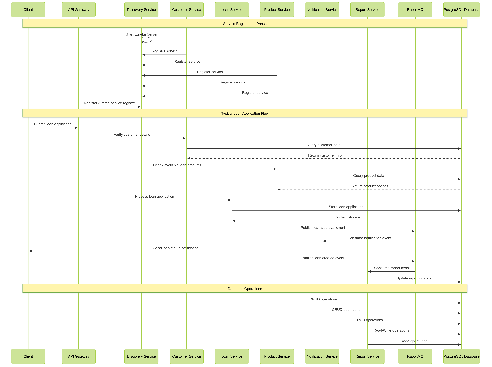

# Lending App - Spring Boot Microservices with PostgreSQL

This project consists of multiple Spring Boot microservices orchestrated with Docker Compose and connected to a shared PostgreSQL database, using a service discovery pattern and message-driven architecture.

---

## 🧱 Architecture Overview

The system follows a microservices architecture with:
- **Service Discovery**: Eureka server for service registration
- **API Gateway**: Central entry point for client requests  
- **Domain Services**: Separate business domains as microservices
- **Message Broker**: RabbitMQ for asynchronous communication
- **Shared Database**: PostgreSQL for persistent storage



---


## 🧱 Services Overview

| Service               | Port  | Description                                       |
|-----------------------|-------|---------------------------------------------------|
| PostgreSQL Database   | 5442  | Central database for all services                 |
| RabbitMQ              | 15672 | Message broker for asynchronous communication     |
| Discovery Service     | 8761  | Eureka service registry for service discovery     |
| API Gateway           | 8800  | Entry point that routes all external traffic      |
| Product Service       | 8801  | Manages loan products and their configurations    |
| Customer Service      | 8802  | Handles customer data and verification            |
| Loan Service          | 8803  | Processes loan applications and management        |
| Notification Service  | 8804  | Sends notifications based on system events        |
| Report Service        | 8806  | Generates analytics and reports from loan data    |

---

## 🚀 Getting Started

### Prerequisites

- [Docker](https://www.docker.com/)
- [Docker Compose](https://docs.docker.com/compose/)

---

### 🏁 How to Start

1. **Clone the repository**:
   ```bash
   git clone https://github.com/VictorOdhiambo/lending-app.git
   cd lending-app
   ```

2. **Ensure your directory structure looks like this**:
   ```
   .
   ├── docker-compose.yml
   ├── db/
   │   └── init.sql
   ├── discovery_service/
   ├── gateway/
   ├── product_service/
   ├── customer_service/
   ├── loan_service/
   ├── notification_service/
   └── report_service/
   ```

3. **Run Docker Compose**:
   ```bash
   docker-compose up --build
   ```

4. **Wait for services to start**. You can visit:
   - [Eureka Dashboard](http://localhost:8761) - View registered services
   - [API Gateway](http://localhost:8800) - Interact with the system
   - [RabbitMQ Management](http://localhost:15672) - Monitor message queues

---

## 🛠️ Database Info

The services use a shared **PostgreSQL** database.

| Parameter       | Value          |
|-----------------|----------------|
| Host            | `postgres-db`  |
| Port            | `5442`         |
| Username        | `postgres`     |
| Password        | `pass@word1`   |
| Default DB Name | `lending_app_db` |

> The `init.sql` file in `db/init.sql` is automatically executed on first run to initialize schema or seed data.

---

## 🔌 Connecting to PostgreSQL

You can connect using any SQL client:

```bash
Host: localhost
Port: 5442
Username: postgres
Password: pass@word1
Database: lending_app_db
```

---

## 🔁 Service Communication

The microservices communicate using two primary methods:
1. **Service Discovery**: Using Eureka for locating services
2. **Event-Driven**: Using RabbitMQ for asynchronous messaging

Key message flows:
- Loan approval events trigger notifications
- Loan creation events update reporting data
- All services perform CRUD operations with the database

---

## 🧪 Testing Service Connections

Each service has its own port for internal testing and REST endpoints:

```bash
# Check available products
curl http://localhost:8800/product/all

# Customer information
curl http://localhost:8800/customer/all

```

---

## 🔁 Restarting from Scratch

If you want to reset everything:

```bash
docker-compose down --volumes --remove-orphans
docker-compose up -d --build
```

---

## 📦 Environment Variables

Services connect to infrastructure using these environment variables:

**Database Connection**:
```env
DB_HOST=postgres-db
DB_PORT=5432
DB_NAME=lending_app_db
DB_USER=postgres
DB_PASSWORD=pass@word1
```

**Service Discovery**:
```env
EUREKA_CLIENT_SERVICEURL_DEFAULTZONE=http://discovery-service:8761/eureka
```

**RabbitMQ Configuration**:
```env
SPRING_RABBITMQ_HOST=rabbitmq
SPRING_RABBITMQ_PORT=5672
SPRING_RABBITMQ_USERNAME=guest
SPRING_RABBITMQ_PASSWORD=guest
```
